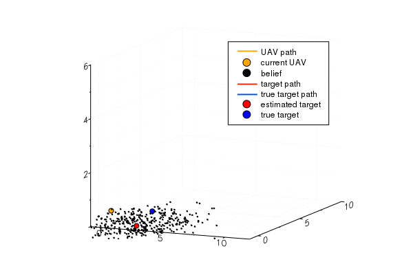

# UAV-autonomous-landing
A UAV autonomously lands on a moving ground platform based on a POMDP model implemented in Julia. The POMDP model is constructed based on the framework of POMDPs.jl (link: https://github.com/JuliaPOMDP/POMDPs.jl)

Problem Overview:
A UAV chases a moving ground platform (the target) and intends to finally land on it.
Assume a full knowledge of the UAV state with the only uncertainty lying on the target state.
A camera installed on the UAV receives intermittent observations of the target to estimate its state.
Assume a noisy measurement of the target location (2D) when it is inside the camera field-of-view,
and no measurements when it is outside.

